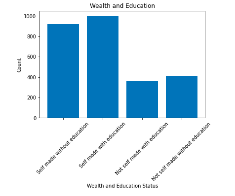

# Project-4-ForbesBillionaires

This project analyzes the The Forbes' Dataset using Python and SQL. The data is obtained from Kaggle and consists of a .csv file that comprises 2750 people whose net wealth equals to or exceeds one billion US Dollars. The file is processed to extract information. Finally this information is processed to analyze. This information is then graphed using tabluea.

Columns Descriptions:

Net Wealth: expressed in USD;
Country of Origin; 
Source: main source from which the wealth is originated;
Rank: Position in terms of wealth;
Age,
Residence;
Citizenship; 
Marital Status;
Children: Number of Children;
Education: Attended University and major;
Self-Made (True/False) origin of wealth;
Geometry: Coordinate of current residence.

- The project performs the following analysis:

1. Wealth Distribution: The distribution of wealth among billionaires.

2. Source of Wealth: The dominant sectors or industries contributing to billionaires' wealth.

3. Mean, Median, Minimum and Maximum of the age.

4. Geospatial distribution: Map the distribution of billionaires worldwide, identifying clusters or concentrations of wealth. Where they from and where they live.

5. Relationship between Education and Wealth: The relationship between education and wealth accumulation. Analyze whether the billonaires have an education or not.

6. Self-Made vs. Inherited Wealth: The proportion of self-made billionaires versus those who inherited their wealth.

7. Marital Status and Children: Status and the number of children on billionaires' wealth.

8. SQL. Is the money: (- Self made without education, -Self made with education, -Not self made with education, .-Not self made without education)

Requirements

The project requires Python 3 and the following libraries:

import pandas as pd
import numpy as np
import sqlalchemy as alch
from getpass import getpass
from dotenv import load_dotenv
import os

# Results

1. Wealth Distribution: 

Mean NetWorth: 4.749219600725953
Median NetWorth: 2.3
Minimum NetWorth: 1.0
Maximum NetWorth: 177.0

People with more than one billón: 2673

People with one billón: 82

Gini Coefficient: 0.5535872462983448

The result of the Gini coefficient is a number between 0 and 1. A Gini coefficient of 0 indicates perfect equality, which means that all people have the same amount of wealth. This would be reflected in a completely equal distribution of wealth. A Gini coefficient of 1 indicates maximum inequality, which means that one person owns all the wealth and the rest have none. In general, the closer the Gini coefficient is to 0, the greater the equality in the distribution of wealth, while the closer it is to 1, the greater the inequality.

The Gini coefficient is calculated using the Lorenz curve, which shows the relative accumulation of wealth as a function of population distribution. The Gini coefficient is calculated by subtracting the area under the Lorenz curve from the area under the line of equality and normalizing it.

Gini coefficient of 0.55 means that the income distribution is relatively unequal.

In terms of percentages, a Gini coefficient of 0.55 means that approximately 55% of the income inequality is present in the distribution. It implies that a significant portion of the total income is concentrated among a smaller fraction of the population, while the majority of the population has a relatively smaller share of the income.

2. Source of Wealth: 

The dominant sectors or industries contributing to billionaires' wealth is Real Estate with 172.

3. Mean Age: 63.267300380228136
Median Age: 63.0
Minimum Age: 18.0
Maximum Age: 99.0

4. Geospatial distribution:

[tableau](https://public.tableau.com/app/profile/jean.paul.bancelin/viz/Project-4-ForbesBillionaires/Dashboard1)

5. Relationship between Education and Wealth:
1346 of the Total has no education, almost the 50%.

6. Self-Made vs. Inherited Wealth:
Self-Made 1960
Inherited 777

7. Marital Status and Children:

Married               1734
Divorced               144
Widowed                 95
Single                  74
In Relationship         21
Separated               10
Widowed, Remarried       8
Engaged                  4

1203 of the Total has no Children.

8.

- Self made without education: 917
- Self made with educationn: 1000
- Not self made with education: 365
- Not self made without education: 412

